<!-- animated contribution graph: real data, boxes reveal cell by cell
     (regenerated daily by .github/workflows/update-profile-art.yml) -->

<h3><code>rudra@github ~ $ ./contributions.sh</code></h3>

 

<!-- profile overview (left) + streak/numbers card (right). both svgs are
     840x880 so equal widths give equal heights.
     profile: python scripts/fetch_profile.py && python scripts/render_profile_svg.py
     stats:   python scripts/fetch_contributions.py && python scripts/render_stats_svg.py
     (same daily workflow) -->

<h3><code>rudra@github ~ $ whoami</code></h3>

<table>
<tr>
<td valign="top"></td>
<td valign="top"></td>
</tr>
</table>

---

## 🚀 About Me

- 🎓 Student exploring **AI agent architectures** and **systems design**
- 🤖 I build multi-agent frameworks — parallel, hierarchical, and swarm-based
- 🔍 I write **OSINT tools** for email & username investigation
- ⚡ I work on **low-level LLM infra** — zero-copy model loading across GGUF, Safetensors, ONNX & PyTorch
- 🌱 Currently learning: how software scales from zero to millions of users
- 💬 Ask me about: Python, agent systems, event-driven architecture, OSINT, model runtimes
- 📬 Reach me: open an issue or discussion on any of my repos — I'm around

---

## 🔬 Featured Projects

### 🧠 Agent Systems
| Project | Description | Stack |
|---|---|---|
| [**Hierarchical-Parallel-Agent**](https://github.com/Rudra-narayan-muduli-001/Hierarchical-Parallel-Agent) | Hierarchical agent system for parallel task execution — Parallel Mind 2.0 | Python · TypeScript |
| [**Parallel_Mind**](https://github.com/Rudra-narayan-muduli-001/Parallel_Mind) | A parallel AI agent search engine for your next AI agent | Python |
| [**Swarm_Agent**](https://github.com/Rudra-narayan-muduli-001/Swarm_Agent) | Framework for implementing & managing multi-agent swarm intelligence | Python |
| [**Python-Event_Bus**](https://github.com/Rudra-narayan-muduli-001/Python-Event_Bus) ⭐2 | A simple Python event bus for your next AI agent | Python |

### 🕵️ OSINT
| Project | Description | Stack |
|---|---|---|
| [**Look_Over**](https://github.com/Rudra-narayan-muduli-001/Look_Over) | OSINT toolkit for email & username investigation | Python · JavaScript |
| [**One_OSINT**](https://github.com/Rudra-narayan-muduli-001/One_OSINT) | All-in-one OSINT toolkit with web interface | JavaScript · Python |

### ⚙️ LLM Infrastructure
| Project | Description | Stack |
|---|---|---|
| [**One_Use**](https://github.com/Rudra-narayan-muduli-001/One_Use) | Unified, hyper-efficient loader for GGUF / Safetensors / ONNX / PyTorch — zero-copy mmap, lazy imports, magic-byte detection | Python |

### ➕ More
| Project | Description | Stack |
|---|---|---|
| [**Scale-to-Millions**](https://github.com/Rudra-narayan-muduli-001/Scale-to-Millions) ⭐2 | Scale your website from zero to millions of users | Docs · Agent Skills |
| [**ChatBot-CLI-1.0**](https://github.com/Rudra-narayan-muduli-001/ChatBot-CLI-1.0) | A simple chatbot with a realtime search engine | Python |
| [**Class-Attendance-Tracker**](https://github.com/Rudra-narayan-muduli-001/Class-Attendance-Tracker) | Web app for tracking class attendance | TypeScript |

---

## 🛠️ Languages & Tools

**Languages**

**AI & Agents**

**LLM & ML Stack**

**Tools & Web**

---

## 🤝 Connect With Me

Open to collaborations on **agent frameworks, OSINT tooling, and LLM infrastructure** — explore my repos and say hi!

